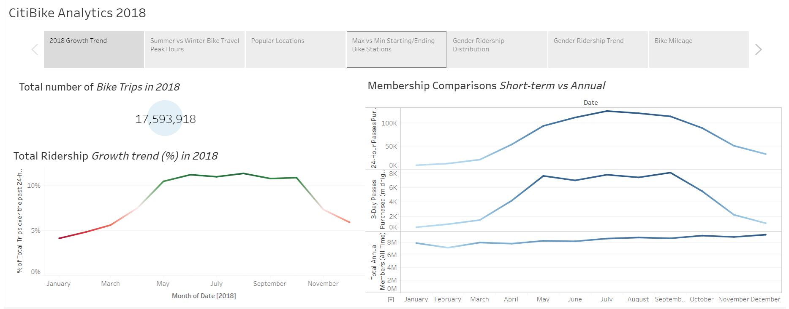
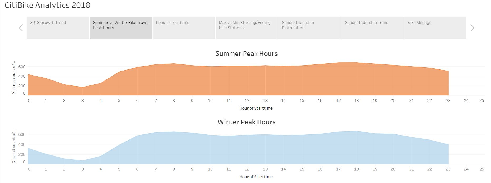
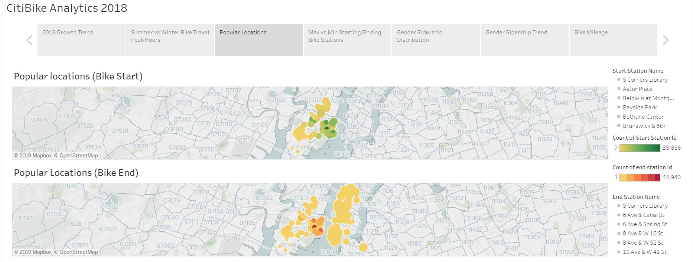
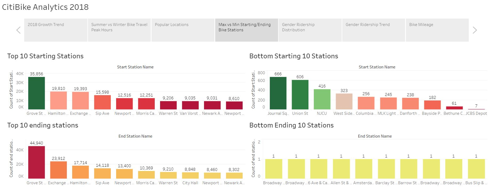
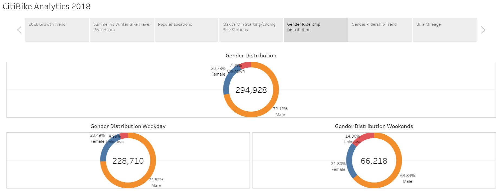
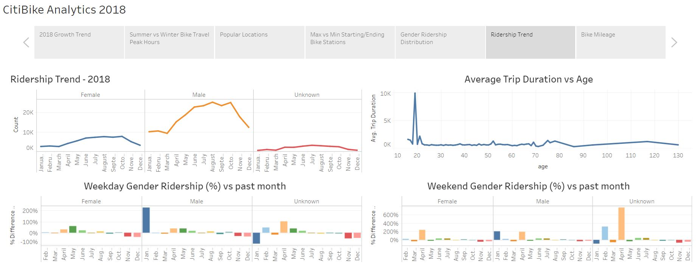
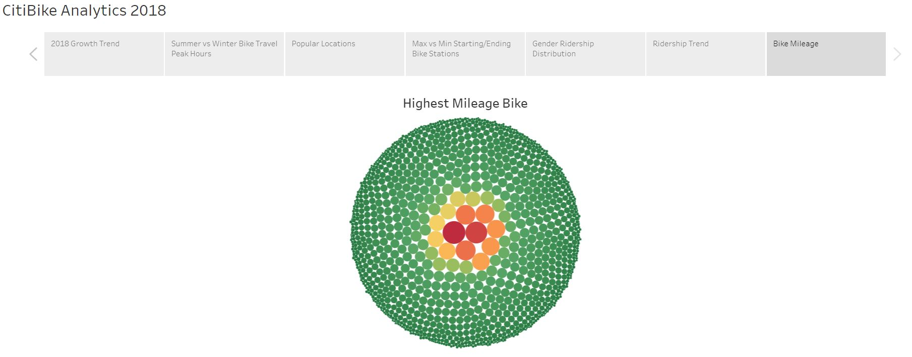

# Citi-Bike-Analytics

Since 2013, the Citi Bike Program has implemented a robust infrastructure for collecting data on the program's utilization. Each month bike data is collected, organized, and made public on the Citi Bike Data webpage.

This Project is based on data range: From January to December, 2018

Data Source: https://www.citibikenyc.com/system-data

Used “CitiBike_data_cleanup.ipynb” to combine large monthly datasets with trip history and quarterly datasets with membership data for 2018 into consolidated csv files

## Interactive Version of the Analysis

Tableau Story:

https://public.tableau.com/profile/bharat.chopra#!/vizhome/CitiBikeAnalysis_15627371124210/CitiBikeAnalytics2018?publish=yes

## Snapshots of the Tableau Story/Dashboards

## Technologies used

Bharat Chopra @UCB @2019
